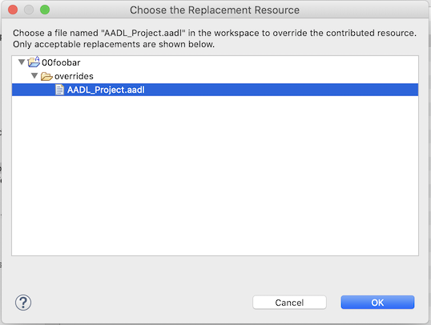

# Advanced OSATE Features

This guide covers advanced features that most users won't ever need to deal with.

## Managing Contributed Resources
	
The AADL standard defines several standard property sets, such as `AADL_Project` and `Timing_Properties`.  In OSATE these are made available in the workspace as plug-in contributions.  They are literally
provided to OSATE by an Eclipse plug-in.  They are globally available within the workspace, that is you do not need to explicitly copy them into your project to use them.  These contributions are visible in the `AADL Navigator` under the `Plug-in Contributions` heading.

Occasionally it may be necessary to "override" a contribution, for example to customize property constant values or to correct errors.  OSATE enables this via the `OSATE > Contributed Resources` preference pane.  

The top of the pane shows a tree that closely mimics the sub-tree shown below the `Plug-in Contributions` item in the `AADL Navigator`.  Selecting an item in the tree shows the Xtext URI of the contributed resource.  
Double-clicking on an item or pressing the `Override` button brings up a selection dialog box.  This dialog is used to select an resource in the workspace that will be used to override the plug-in contributed resource.
The overriding resource must have the same filename as the original resource; the selection dialog only shows those files in the workspace that have the same name.  The below selection dialog shows the replacement 
resource for `AADL_Project` being selected:

When a contributed resource is overridden, the tree marks it as such, and the URI shows the workspace URI of the overriding resource:

To restore an overridden resource to its original contributed URI, select it in the tree and press the "Restore" button. 
